# Building a Blog Application

The project was built while following *Django 5 By Example* by Antonio Melé.

---

### Chapter 1: Building a Blog Application

## This chapter will cover the following topics:

---

### This chapter will cover the following topics:
- Installing Python
- Creating a Python virtual environment
- Installing Django
- Creating and configuring a Django project
- Building a Django application
- Designing data models
- Creating and applying model migrations
- Setting up an administration site for your models
- Working with QuerySets and model managers
- Building views, templates, and URLs
- Understanding the Django request/response cycle

---
  
### Set Up

### Installing Python
Django 5.0 does not support Python 3.13.x. Therefore, Python 3.12.x was used.
- python -m pip install Django~=5.0.4

## Creating a Python Virtual Environment
- python -m venv my_env

## Activate 
- .\my_env\Scripts\activate

## Install Django
- python -m pip install Django~=5.0.4

### Main Framework Components
- Model
- Template
- View
  
### The Django architecture

### Figure 1.1 The Django architecture

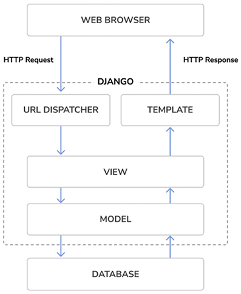

<p>Figure 1.1 The Django architecture</p>

## Creating your first project

### Figure 1.2 Diagram of functionalities built in Chapter 1

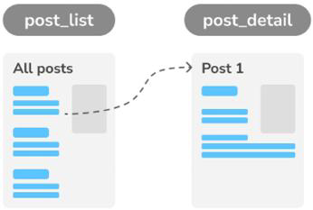

<p>Figure 1.2 Diagram of functionalities built in Chapter 1</p>
- django-admin startproject mysite

### Applying initial database migrations
- python manage.py migrate

### Running the development server
- python manage.py runserver

## Creating an application
- python manage.py startapp blog

## Creating and applying migrations
- python manage.py makemigrations blog

## Activating the application
settings.py
- Add `blog.apps.BlogConfig' to `INSTALLED_APPS`

## Creating and applying migrations
- python manage.py makemigrations blog
```text
Let’s take a look at the SQL code that Django will execute in the database to create the table for your model.
```
- python manage.py sqlmigrate blog 0001
- python manage.py migrate

## Applying initial database migrations
- python manage.py migrate

### Running the development server
- python manage.py runserver
  
### Figure 1.3 The default page of the Django development server

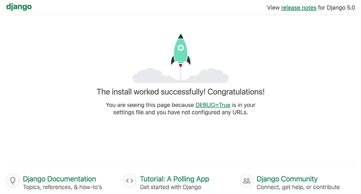

<p>Figure 1.3 The default page of the Django development server</p>

### Project Settings

### Projects and Applications

### Figure 1.4 The Django project - application structure

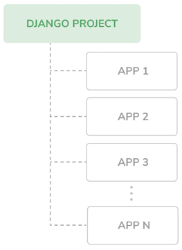

<p>Figure 1.4 The Django project - application structure</p>

### Creating an Application

### Creating the Blog Data Models

### Creating the Post Model

### Figure 1.5 Initial Post model and database table correspondence

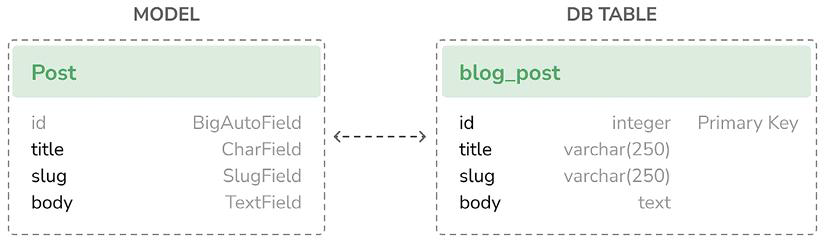

<p>Figure 1.5 Initial Post model and database table correspondence</p>

### Adding Datetime Fields

### Defining a default sort order

### Adding a Database Index

### Activating the Application
Update settings.py
- Add `blog.apps.BlogConfig'` to `INSTALLED_APPS`

### Adding a status field

### Adding a Many-to-One Relationship

### Creating and applying migrations
- python manage.py makemigrations blog
- python manage.py sqlmigrate blog 0001

### The Following Three Database Indexes Are Created

### Figure 1.6 Complete Post model and database table correspondence

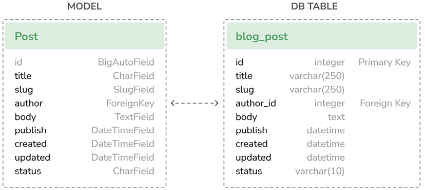

<p>Figure 1.6 Complete Post model and database table correspondence</p>
- python manage.py migrate

### Creating an administration site for models

## Creating a superuser
python manage.py createsuperuser
Username (leave blank to use 'admin'): admin
Email address: admin@admin.com
Password: ********
Password (again): ********

### The Django Administration Site
- python manage.py runserver

### Figure 1.7 The Django administration site login screen

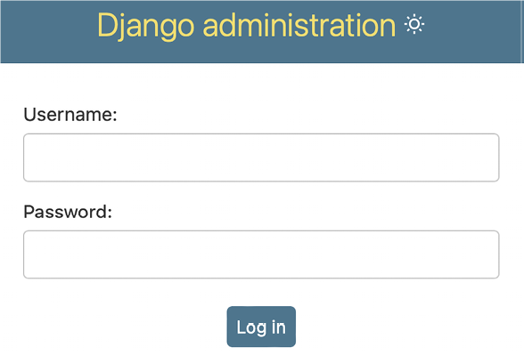

<p>Figure 1.7 The Django administration site login screen</p>

### Figure 1.8 The Django administration site index page

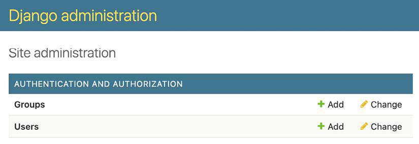

<p>Figure 1.8 The Django administration site index page</p>

### Adding Models to the Administration Site

### Figure 1.9 The Post model of the blog application included in the Django administration site index page

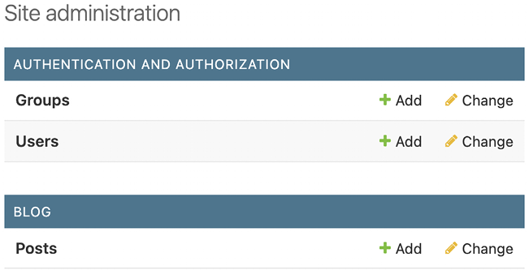

<p>Figure 1.9 The Post model of the blog application included in the Django administration site index page</p>

### Click on the Add Link Beside Posts to Add a New Post

### Figure 1.10 The Django administration site edit form for the Post model

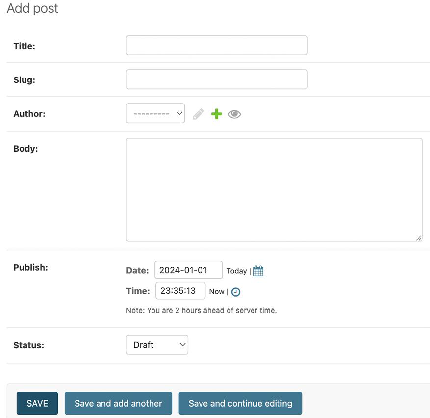

<p>Figure 1.10 The Django administration site edit form for the Post model</p>

### Figure 1.11 The Django administration site list view for the Post model with an added successfully message

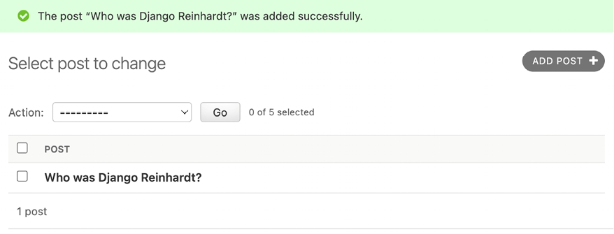

<p>Figure 1.11 The Django administration site list view for the Post model with an added successfully message</p>

### Customizing How Models Are Displayed

### Figure 1.12 The Django administration site custom list view for the Post model

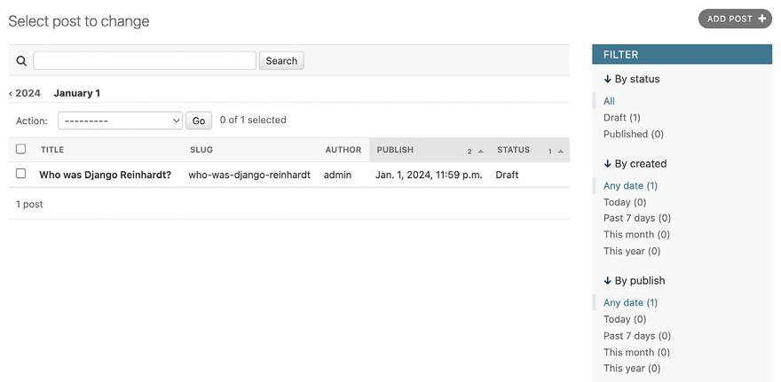

<p>Figure 1.12 The Django administration site custom list view for the Post model</p>

### Figure 1.13 The slug model is now automatically prepopulated as you type in the title

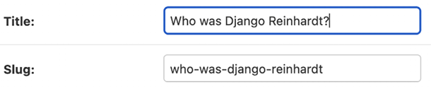

<p>Figure 1.13 The slug model is now automatically prepopulated as you type in the title</p>

### Figure 1.14 The widget to select related objects for the Author field of the Post model

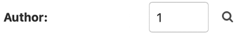

<p>Figure 1.14 The widget to select related objects for the Author field of the Post model</p>

### Adding Facet Counts to Filters

### Figure 1.15 Status field filters including facet counts

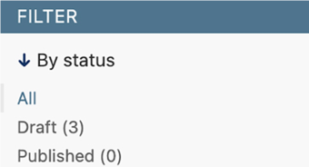

<p>Figure 1.15 Status field filters including facet counts</p>

### Working with QuerySets and Managers

## Creating Objects
- python manage.py shell
- Test
  
## Updating Objects

## Retrieving Objects

## Filtering Objects

## Using Field Lookups

## Chaining Filters

## Excluding Objects

## Ordering Objects

## Limiting QuerySets

## Counting Objects

## Checking if an Object Exists

## Deleting Objects

## Complex Lookups with Q Objects

## When QuerySets Are Evaluated

## More on QuerySets

### Creating Model Managers

## Building List and Detail Views

## Creating List and Detail Views

## Using the get_object_or_404 Shortcut

### Adding URL Patterns for Your Views

### Creating Templates for Your Views

## Creating a Base Template

## Creating the Post List Template

### Accessing Our Application

### Figure 1.16 The status field for a published post

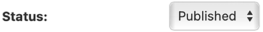

<p>Figure 1.16 The status field for a published post</p>

### Figure 1.17 The page for the post list view

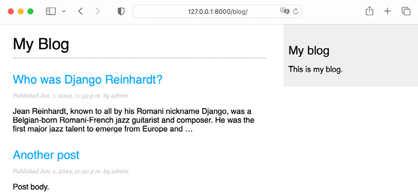

<p>Figure 1.17 The page for the post list view</p>

### Creating the Post Detail Template

### Figure 1.18 The page for the post's detail view

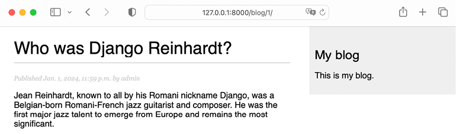

<p>Figure 1.18 The page for the post's detail view</p>

### The Request/Response Cycle

### Figure 1.19 The Django request - response cycle

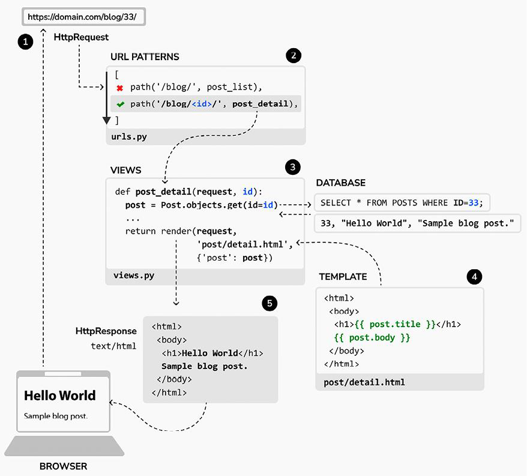

<p>Figure 1.19 The Django request - response cycle</p>

---

### Chapter 2: Enhancing Your Blog and Adding Social Features

In this chapter, you will learn the following topics:
- Using canonical URLs for models
- Creating SEO-friendly URLs for posts
- Adding pagination to the post list view
- Building class-based views
- Sending emails with Django
- Using Django forms to share posts via email
- Adding comments to posts using forms from models

### Functional Overview

### Figure 2.1 Diagram of functionalities built in Chapter 2

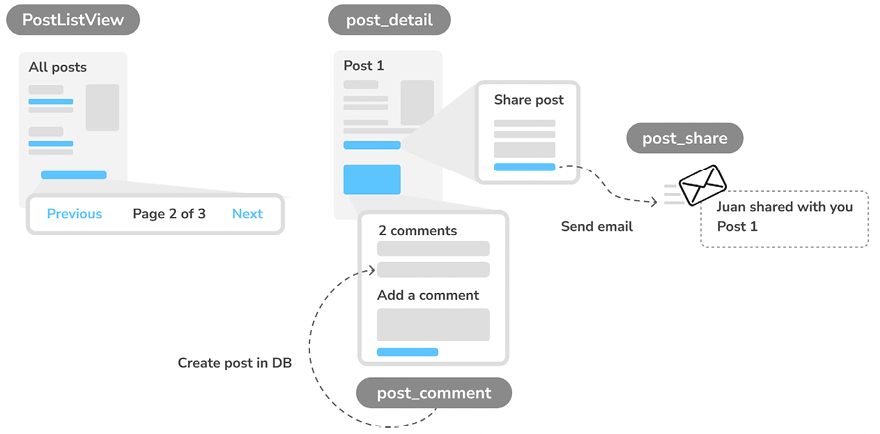

<p>Figure 2.1 Diagram of functionalities built in Chapter 2</p>

### Using Canonical URLs for Models

### Creating SEO-Friendly URLs for Posts
- python manage.py makemigrations blog
- python manage.py migrate

### Modifying the URL Patterns

### Modifying the Views

### Modifying the Canonical URL for Posts
- python manage.py runserver
  
### Figure 2.2 The page for the post's detail view

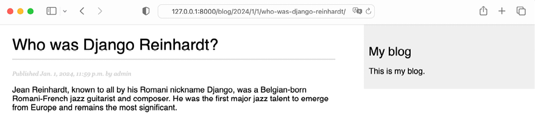

<p>Figure 2.2 The page for the post's detail view</p>

### Adding Pagination

### Figure 2.3 Google pagination links for search result pages

```text
For example, Google uses pagination to divide search results across multiple
pages. Figure 2.3 shows Google’s pagination links for search result pages 
```

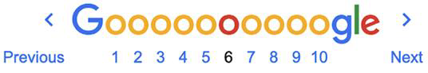

<p>Figure 2.3 Google pagination links for search result pages</p>

## Adding Pagination to the Post List View

## Creating a Pagination Template

### Figure 2.4 The post list page including pagination

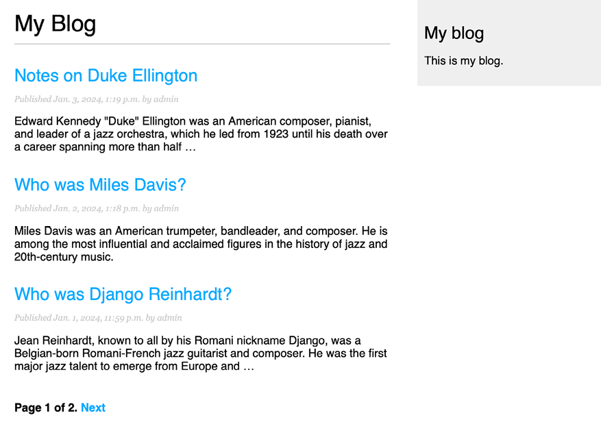

<p>Figure 2.4 The post list page including pagination</p>

### Figure 2.5 The second page of results

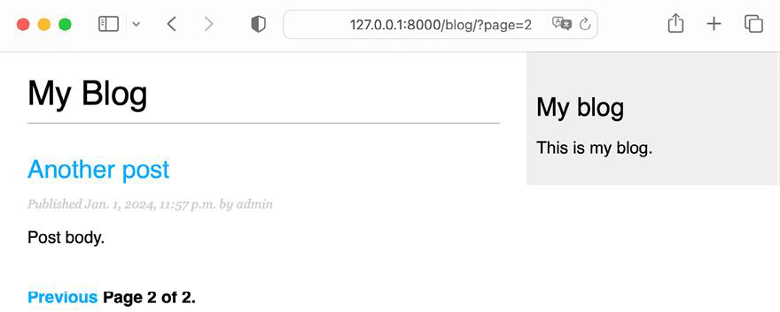

<p>Figure 2.5 The second page of results</p>

### Handling Pagination Errors

### Figure 2.6 The EmptyPage error page

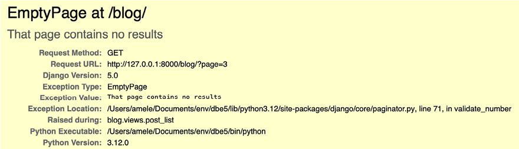

<p>Figure 2.6 The EmptyPage error page</p>

### Figure 2.7 The last page of results

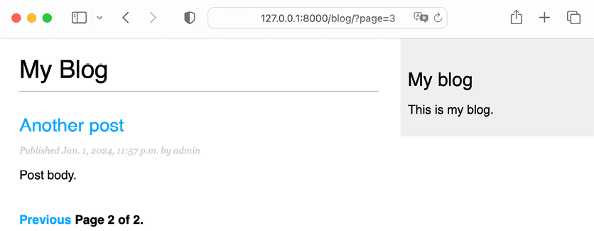

<p>Figure 2.7 The last page of results</p>

### Figure 2.8 The PageNotAnInteger error page

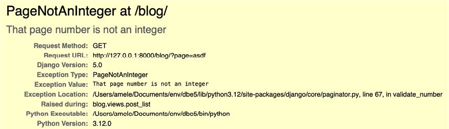

<p>Figure 2.8 The PageNotAnInteger error page</p>

### Figure 2.9 The first page of results

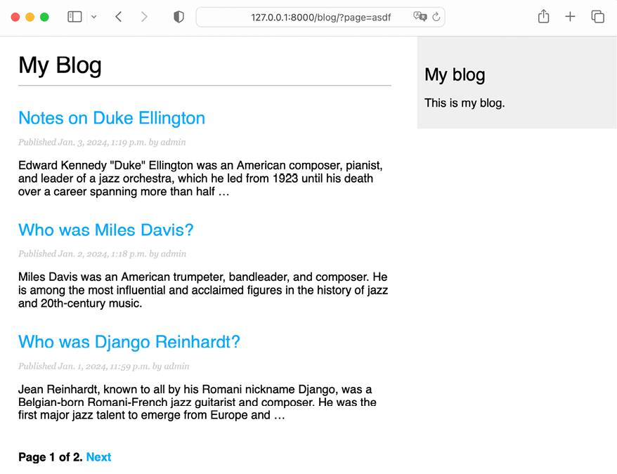

<p>Figure 2.9 The first page of results</p>

### Building Class-Based Views

## Why Use Class-Based Views

## Using a Class-Based View to List Posts

### Figure 2.10 HTTP 404 Page not found response

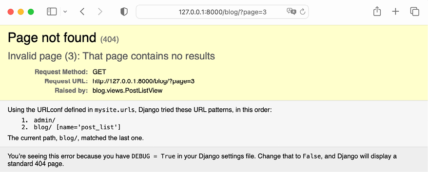

<p>Figure 2.10 HTTP 404 Page not found response</p>

### Recommending Posts by Email

## Creating Forms with Django
- name
- email
- to: An instance of  EmailField
- comments
  
## Handling Forms in Views

## Sending Emails with Django

### Working with Environment Variables
- Security
- Flexibility
- Maintainability
- python -m pip install python-decouple==3.8

## create a new file and name it .env
EMAIL_HOST_USER=your_account@gmail.com
EMAIL_HOST_PASSWORD=
DEFAULT_FROM_EMAIL=My Blog <your_account@gmail.com>

## Update settings.py
EMAIL_HOST = 'smtp.gmail.com'
EMAIL_HOST_USER = config('EMAIL_HOST_USER')
EMAIL_HOST_PASSWORD = config('EMAIL_HOST_PASSWORD')
EMAIL_PORT = 587
EMAIL_USE_TLS = True
DEFAULT_FROM_EMAIL = config('DEFAULT_FROM_EMAIL')

## Update settings.py
EMAIL_BACKEND = 'django.core.mail.backends.console.EmailBackend'

### Figure 2.11 The sign in to Google page for Google accounts

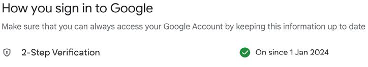

<p>Figure 2.11 The sign in to Google page for Google accounts</p>

### Figure 2.12 Form to generate a new Google app password

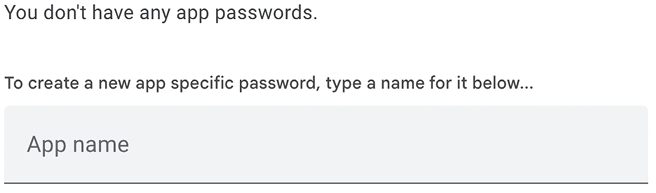

<p>Figure 2.12 Form to generate a new Google app password</p>

### Figure 2.13 Form to generate a new Google app password

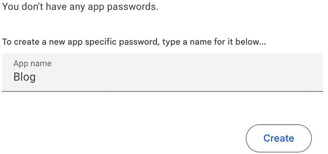

<p>Figure 2.13 Form to generate a new Google app password</p>

### Figure 2.14 Generated Google app password

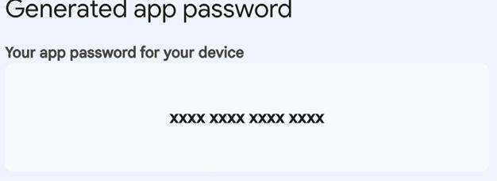

<p>Figure 2.14 Generated Google app password</p>

## Copy the generated app password, edit the .env
EMAIL_HOST_PASSWORD variable, as follows:
EMAIL_HOST_USER=your_account@gmail.com
EMAIL_HOST_PASSWORD=xxxxxxxxxxxxxxxx
DEFAULT_FROM_EMAIL=My Blog <your_account@gmail.com>

### Open the Python shell to test
- python manage.py shell
- 
### Figure 2.15 Test email sent displayed in Gmail

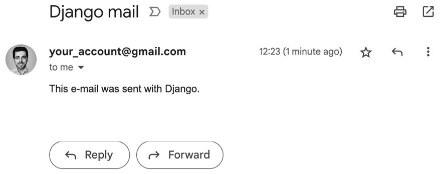

<p>Figure 2.15 Test email sent displayed in Gmail</p>

### Sending Emails in Views

### Rendering Forms in Templates

### Open server
- python manage.py runserver

### Figure 2.16 The post detail page, including a link to share the post

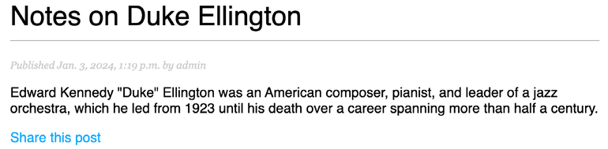

<p>Figure 2.16 The post detail page, including a link to share the post</p>

### Figure 2.17 The page to share a post via email

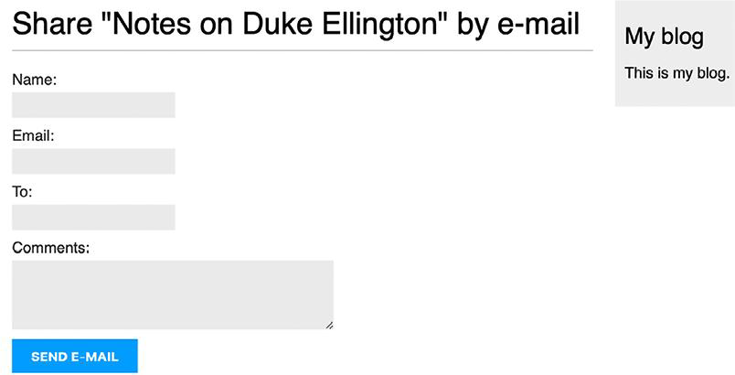

<p>Figure 2.17 The page to share a post via email</p>

### Figure 2.18 A success message for a post shared via email

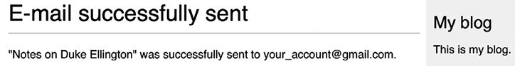

<p>Figure 2.18 A success message for a post shared via email</p>

### Figure 2.19 Test email sent displayed in Gmail

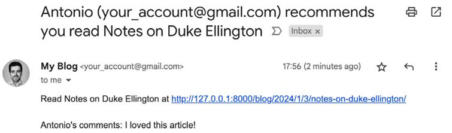

<p>Figure 2.19 Test email sent displayed in Gmail</p>

### Figure 2.20 The share post form displaying invalid data errors

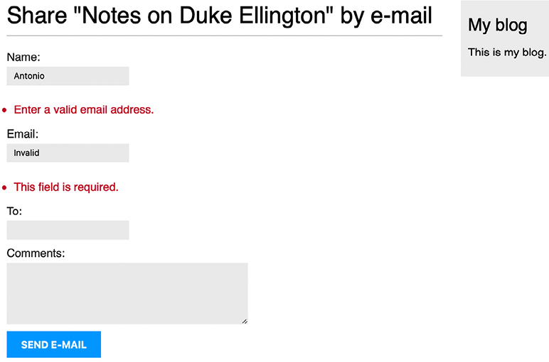

<p>Figure 2.20 The share post form displaying invalid data errors</p>

### Creating a Comment System
- A comment model to store user comments on posts
- A Django form that allows users to submit comments and manages the data validation
- A view that processes the form and saves a new comment to the database
- A list of comments and the HTML form to add a new comment that can be included in the post   detail template
- 
## Creating a Model for Comments
- python manage.py makemigrations blog
- python manage.py migrate

### Adding Comments to the Administration Site

### Figure 2.21 Blog application models on the Django administration index page

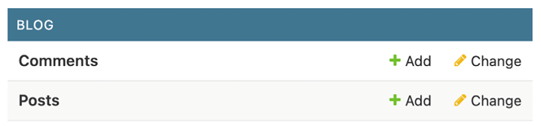

<p>Figure 2.21 Blog application models on the Django administration index page</p>

### Figure 2.22 Form to add a new comment in the Django administration site

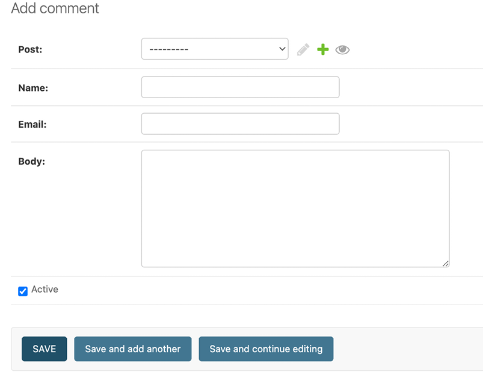

<p>Figure 2.22 Form to add a new comment in the Django administration site</p>

### Creating Forms from Models

### Handling ModelForms in Views

### Creating Templates for the Comment Form
- In the post detail template associated with the post_detail view to let users publish     comments.
- In the post comment template associated with the post_comment view to display the form again if there are any form errors.
  
## Adding Comments to the Post Detail View

## Adding Comments to the Post Detail Template

### Figure 2.23 The post detail page, including the form to add a comment

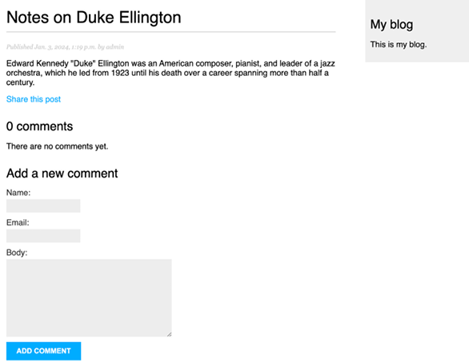

<p>Figure 2.23 The post detail page, including the form to add a comment</p>

### Figure 2.24 The comment added success page

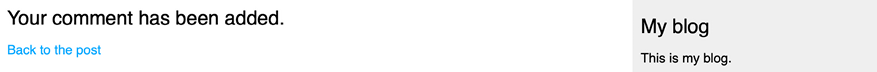

<p>Figure 2.24 The comment added success page</p>

### Figure 2.25 The post detail page, including a comment

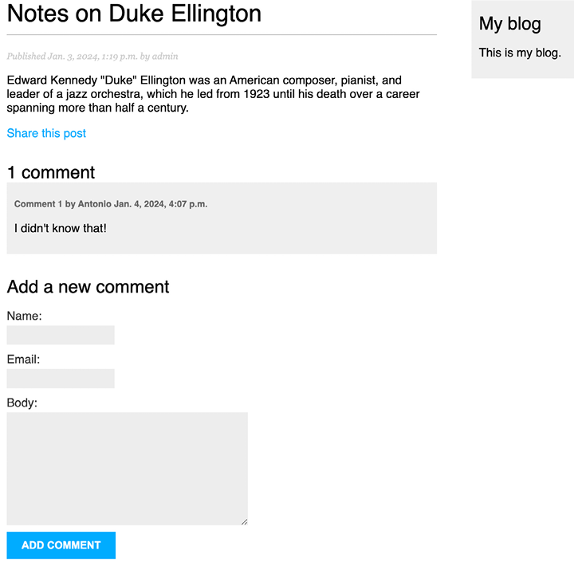

<p>Figure 2.25 The post detail page, including a comment</p>

### Figure 2.26 The comment list on the post detail page

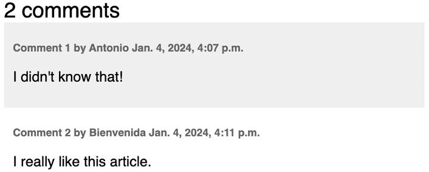

<p>Figure 2.26 The comment list on the post detail page</p>

### Figure 2.27 List of comments on the administration site

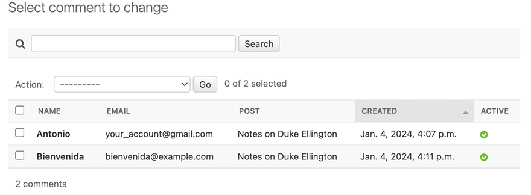

<p>Figure 2.27 List of comments on the administration site</p>

### Figure 2.28 Editing a comment on the administration site

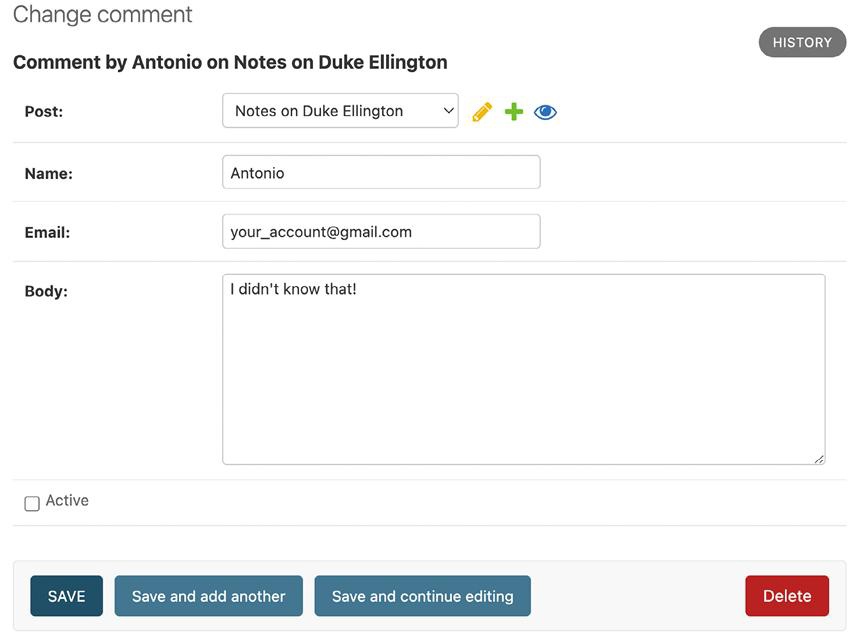

<p>Figure 2.28 Editing a comment on the administration site</p>

### Figure 2.29 Active- inactive comments on the administration site

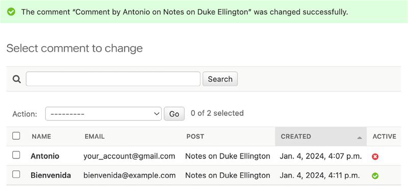

<p>Figure 2.29 Active- inactive comments on the administration site</p>

### Figure 2.30 A single active comment displayed on the post detail page

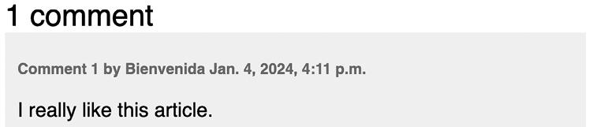

<p>Figure 2.30 A single active comment displayed on the post detail page</p>

### Using simplified templates for form rendering

### Figure 2.31 The comment form with the new HTML markup

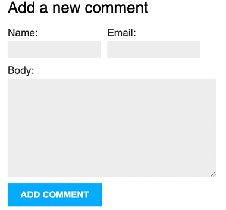

<p>Figure 2.31 The comment form with the new HTML markup</p>

---

### Chapter 3: Extending Your Blog Application

- The chapter will cover the following topics:
- Implementing tagging using django-taggit
- Retrieving posts by similarity
- Creating custom template tags and filters to display the latest posts and most commented     posts
- Adding a sitemap to the site
- Creating feeds for blog posts
- Installing PostgreSQL
- Using fixtures to dump and load data into the database
- Implementing a full-text search engine with Django and PostgreSQL

### Functional Overview

### Figure 3.1 Diagram of functionalities built in Chapter 3

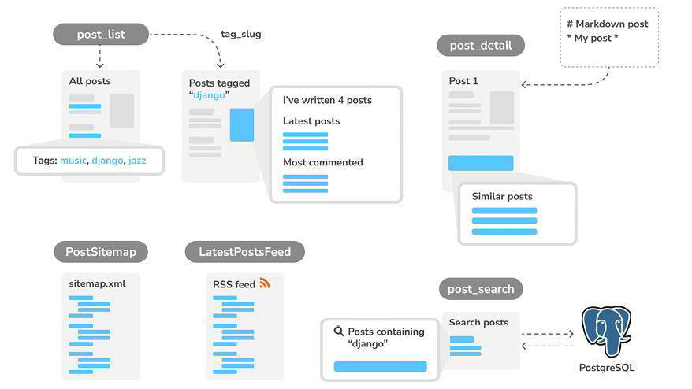

<p>Figure 3.1 Diagram of functionalities built in Chapter 3</p>

### Implementing Tagging with django-taggit
- python -m pip install django-taggit==5.0.1
settings.py
- Add 'taggit' to `INSTALLED_APPS`
- python manage.py makemigrations blog
- python manage.py migrate

### Figure 3.2 Tag models of django-taggit

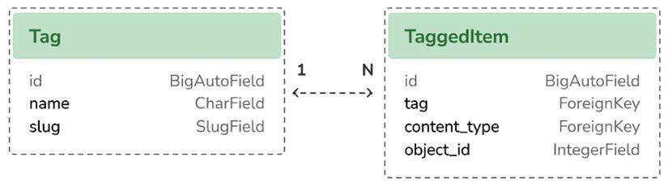

<p>Figure 3.2 Tag models of django-taggit</p>

- python manage.py makemigrations blog
- python manage.py migrate

### Open the Django shell to test
-python manage.py shell

## Open server
- python manage.py runserver
  
### Figure 3.3 The tag change list view on the Django administration site

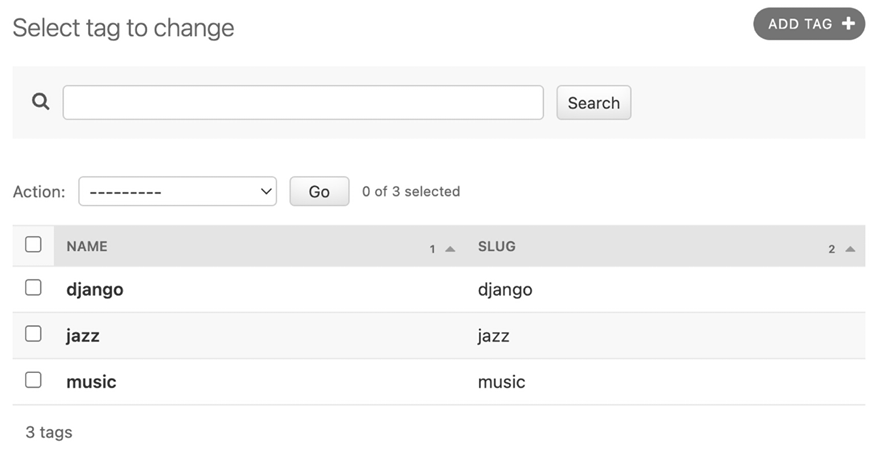

<p>Figure 3.3 The tag change list view on the Django administration site</p>

### Figure 3.4 The tag edit view on the Django administration site

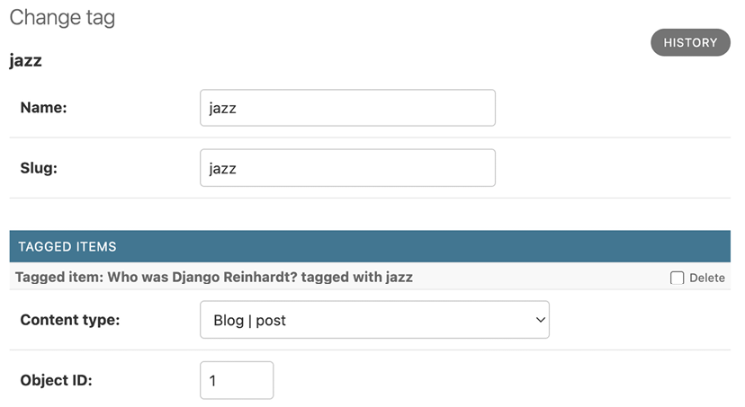

<p>Figure 3.4 The tag edit view on the Django administration site</p>

### Figure 3.5 The related Tags field of a Post object

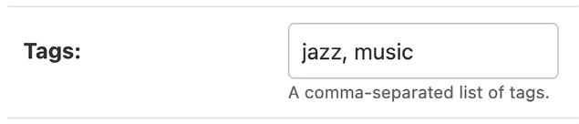

<p>Figure 3.5 The related Tags field of a Post object</p>

### Figure 3.6 The Post list item, including related tags

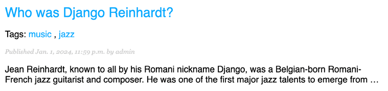

<p>Figure 3.6 The Post list item, including related tags</p>

### Figure 3.7 A post filtered by the tag "jazz"

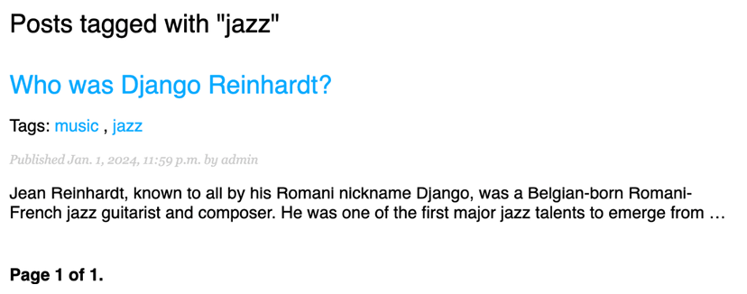

<p>Figure 3.7 A post filtered by the tag "jazz"</p>

### Retrieving Posts by Similarity
1. Retrieve all tags for the current post.
2. Get all posts that are tagged with any of those tags.
3. Exclude the current post from that list to avoid recommending the same post.
4. Order the results by the number of tags shared with the current post.
5. In the case of two or more posts with the same number of tags, recommend the most recent post.
6. Limit the query to the number of posts you want to recommend.

### Figure 3.8 The post detail page, including a list of similar posts

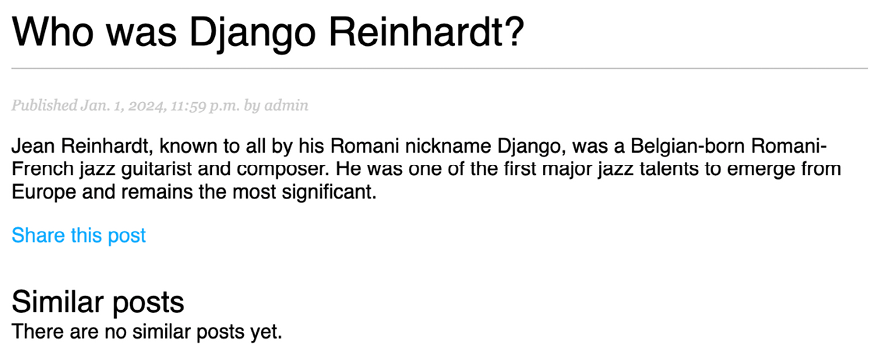

<p>Figure 3.8 The post detail page, including a list of similar posts</p>

### Figure 3.9 Adding the "jazz" and "music" tags to a post

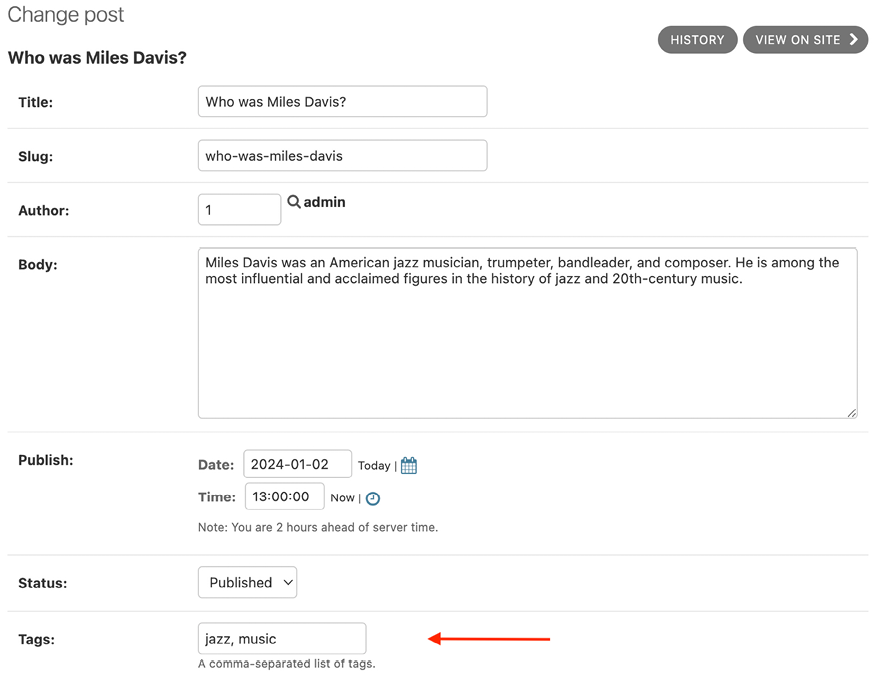

<p>Figure 3.9 Adding the "jazz" and "music" tags to a post</p>

### Figure 3.10 Adding the "jazz" tag to a post

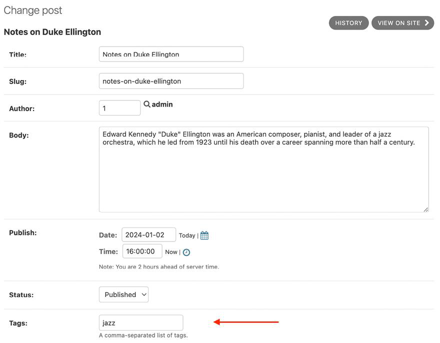

<p>Figure 3.10 Adding the "jazz" tag to a post</p>

### Figure 3.11 The post detail page, including a list of similar posts

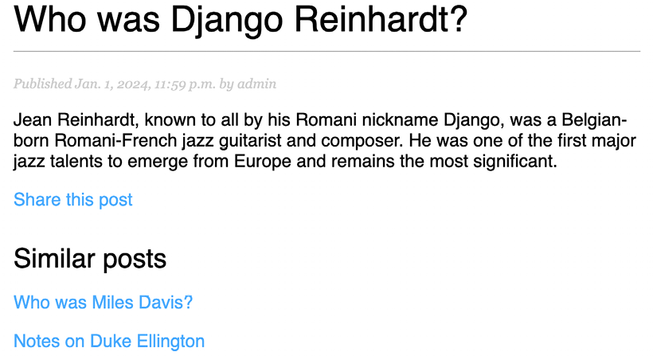

<p>Figure 3.11 The post detail page, including a list of similar posts</p>

### Creating Custom Template Tags and Filters

### Implementing Custom Template Tags
- simple_tag : Processes the given data and returns a string
- inclusion_tag : Processes the given data and returns a rendered template

### Creating a Simple Template Tag

### Figure 3.12 The total posts published included in the sidebar

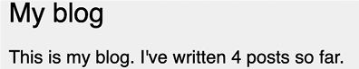

<p>Figure 3.12 The total posts published included in the sidebar</p>

### Figure 3.13 The error message when a template tag library is not registered

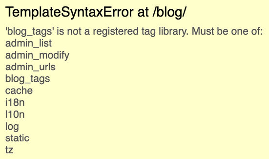

<p>Figure 3.13 The error message when a template tag library is not registered</p>

### Creating an Inclusion Template Tag

### Figure 3.14 The blog sidebar, including the latest published posts

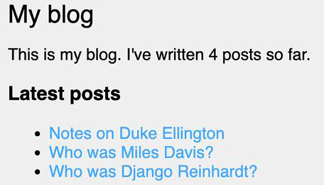

<p>Figure 3.14 The blog sidebar, including the latest published posts</p>

### Creating a Template Tag that Returns a QuerySet

### Figure 3.15 The post list view, including the complete sidebar with the latest and most commented posts

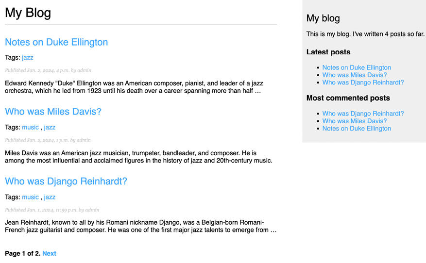

<p>Figure 3.15 The post list view, including the complete sidebar with the latest and most commented posts</p>

### Implementing Custom Template Filters

### Creating a Template Filter to Support Markdown Syntax
python -m pip install markdown==3.6

### Figure 3.16 The post with Markdown content rendered as HTML

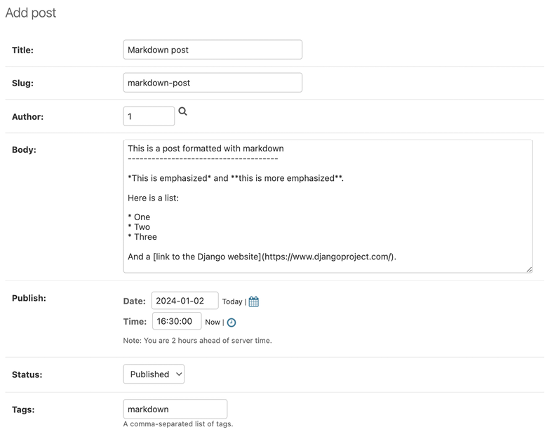

<p>Figure 3.16 The post with Markdown content rendered as HTML</p>

### Figure 3.17 The post with Markdown content rendered as HTML

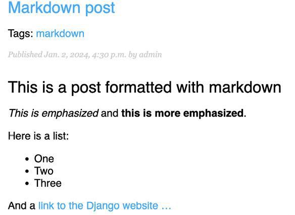

<p>Figure 3.17 The post with Markdown content rendered as HTML</p>

### Adding a Sitemap to the Site
Update settings.py
- Add `django.contrib.sites` to `INSTALLED_APPS`
- Add `django.contrib.sitemaps` to `INSTALLED_APPS`
- python manage.py migrate
- python manage.py runserver

### Figure 3.18 The Django administration list view for the Site model of the site's framework

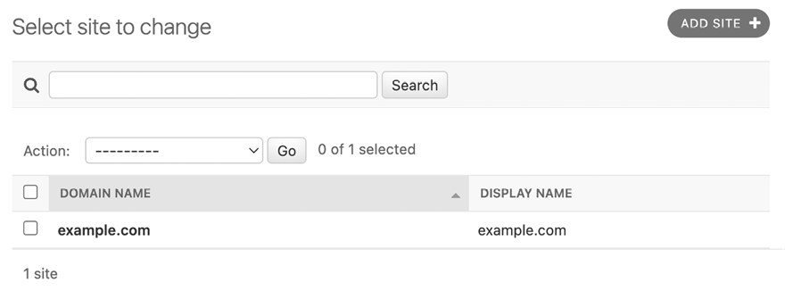

<p>Figure 3.18 The Django administration list view for the Site model of the site's framework</p>

### Figure 3.19 The Django administration edit view for the Site model of the site's framework

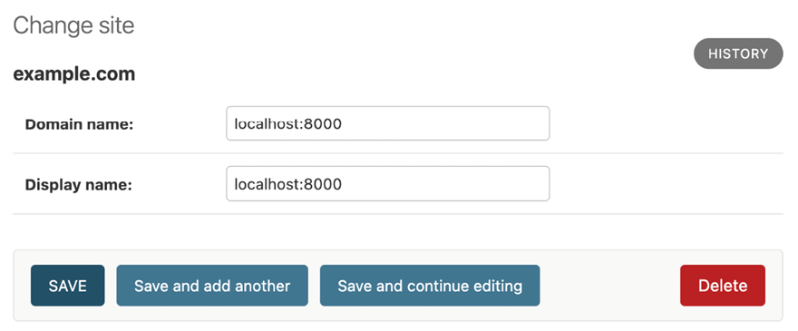

<p>Figure 3.19 The Django administration edit view for the Site model of the site's framework</p>

### Creating Feeds for Blog Posts

### Figure 3.20 Fluent Reader with no RSS feed sources

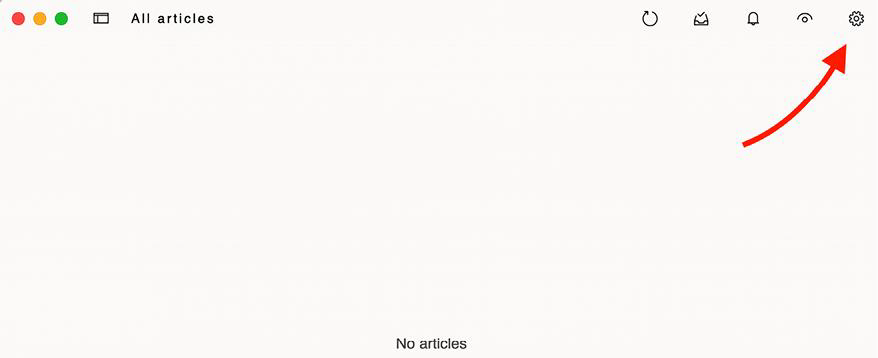

<p>Figure 3.20 Fluent Reader with no RSS feed sources</p>

### Figure 3.21 Adding an RSS feed in Fluent Reader

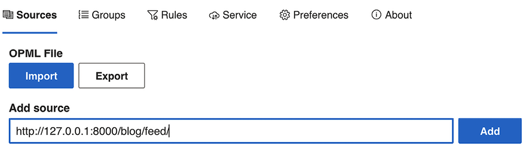

<p>Figure 3.21 Adding an RSS feed in Fluent Reader</p>

### Figure 3.22 RSS feed sources in Fluent Reader


<p>Figure 3.22 RSS feed sources in Fluent Reader</p>

### Figure 3.23 RSS feed of the blog in Fluent Reader

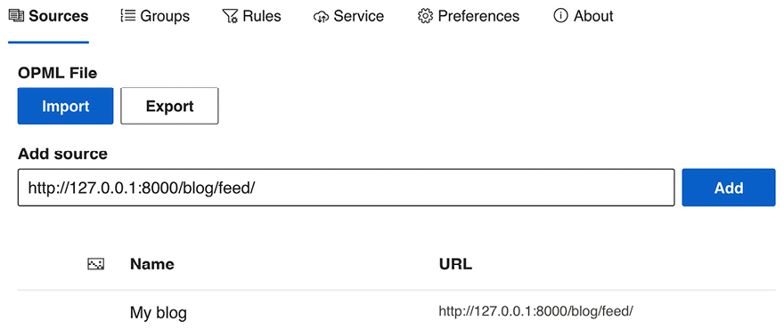

<p>Figure 3.23 RSS feed of the blog in Fluent Reader</p>

### Figure 3.24 The post description in Fluent Reader

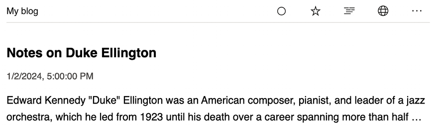

<p>Figure 3.24 The post description in Fluent Reader</p>

### Figure 3.25 The full content of a post in Fluent Reader

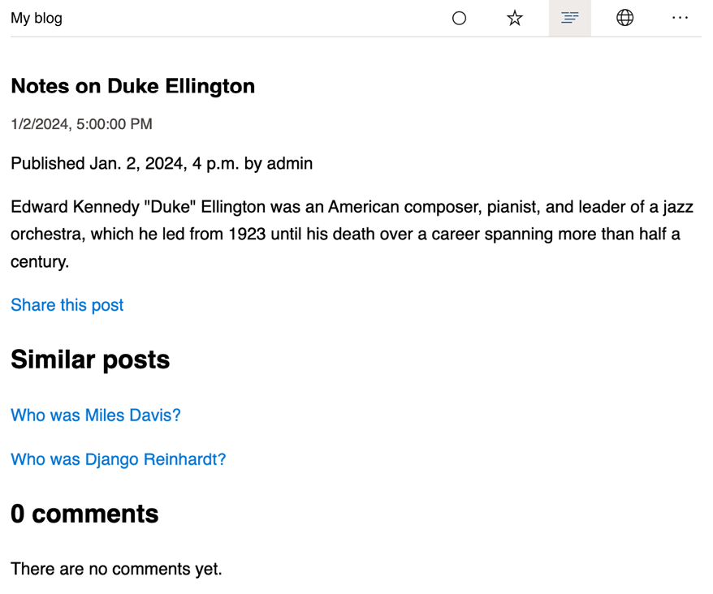

<p>Figure 3.25 The full content of a post in Fluent Reader</p>

### Figure 3.26 The RSS feed subscription link added to the sidebar

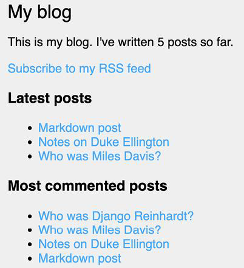

<p>Figure 3.26 The RSS feed subscription link added to the sidebar</p>

### Adding Full-Text Search to the Blog

### Installing Docker

### Installing PostgreSQL
- docker pull postgres:16.2
- docker run --name=blog_db -e POSRGRES_DB=blog -e POSTGRES_USER=bl
- Replace xxxxx with the desired password for your database user.
  
### Figure 3.27 PostgreSQL instance running in Docker Desktop

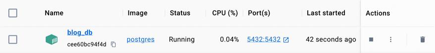

<p>Figure 3.27 PostgreSQL instance running in Docker Desktop</p>

### Dumping the Existing Data
- python manage.py dumpdata --indent=2 --output=mysite_data.json
- python -Xutf8 manage.py dumpdata --indent=2 --output=mysite_data.
  
### Switching the Database in the Project
Update settings.py
DATABASES = {
'default': {
'ENGINE': 'django.db.backends.postgresql',
'NAME': config('DB_NAME'),
'USER': config('DB_USER'),
'PASSWORD': config('DB_PASSWORD'),
'HOST': config('DB_HOST'),
  }
}

Update .env
DB_NAME=blog
DB_USER=blog
DB_PASSWORD=xxxxx
DB_HOST=localhost
- Replace xxxxxx with the password you used when starting the PostgreSQL container. The new database is empty
- python manage.py migrate

### Loading the Data into the New Database
- python manage.py loaddata mysite_data.json

## Open server
- python manage.py runserver
  
### Figure 3.28 The list of posts on the administration site

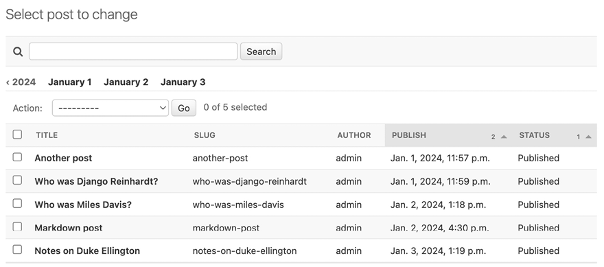

<p>Figure 3.28 The list of posts on the administration site</p>

### Simple Search Lookups
Update settings.py
- Add `django.contrib.postgres` to `INSTALLED_APPS`

## Open the Django shell to test
- python manage.py shell

### Searching Against Multiple Fields

### Building a Search View

### Figure 3.29 The form with the query field to search for posts

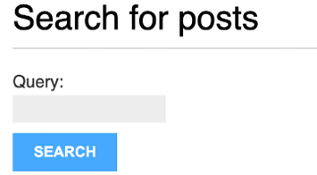

<p>Figure 3.29 The form with the query field to search for posts</p>

### Figure 3.30 Search results for the term "jazz"

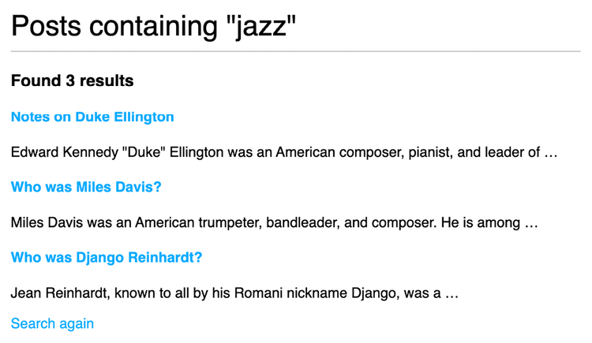

<p>Figure 3.30 Search results for the term "jazz"</p>

### Stemming and Ranking Results

### Figure 3.31 Search results for the term "django"

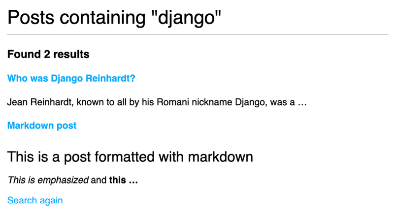

<p>Figure 3.31 Search results for the term "django"</p>

### Stemming and Removing Stop Words in Different Languages

### Weighting Queries

### Searching with Trigram Similarity
- python manage.py makemigrations - name=trigram_ext --empty blog
- python manage.py migrate blog
  
### Figure 3.32 Search results for the term "yango"

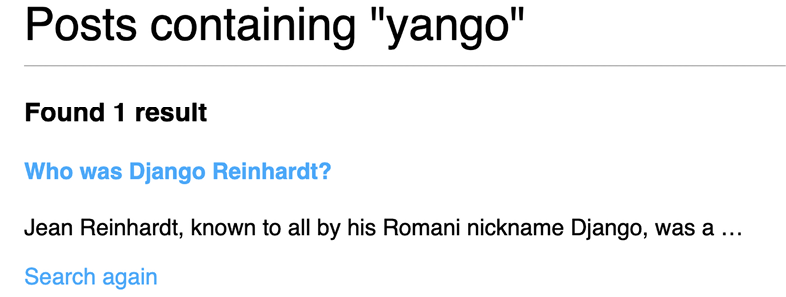

<p>Figure 3.32 Search results for the term "yango"</p>

---

## Link for Building a Blog Application code:

https://github.com/jeanmarc-webdev/building-a-blog-application
